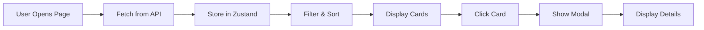

# Kiosk and Restaurant Management Pages - Implementation Summary

## ✅ Feature Completed

Created comprehensive management pages for Kiosks and Restaurants with full search, filtering, sorting, and detailed view capabilities.

---

## 🎯 What Was Created

### 1. **Kiosks Management Page** (`/kiosks`)

**Features:**
- ✅ **Search** - Find kiosks by name
- ✅ **Filter by Status** - All / Operational / Offline
- ✅ **Sort** - By name, utilization, or queue length
- ✅ **Summary Stats** - Total, operational, charging, avg utilization
- ✅ **Card View** - Visual cards with utilization bars
- ✅ **Detail Modal** - Click any kiosk for full details
- ✅ **Real-time Metrics** - Charging status, queue, drone count
- ✅ **Visual Indicators** - Color-coded utilization badges
- ✅ **Charging Slots** - Visual bar showing occupied vs available

**Metrics Displayed:**
- Utilization percentage (color-coded: green < 50%, yellow 50-80%, red > 80%)
- Charging slots (in use / total)
- Queue length
- Current drones (count / capacity)
- Coverage radius
- Operational status

### 2. **Restaurants Management Page** (`/restaurants`)

**Features:**
- ✅ **Search** - Find restaurants by name
- ✅ **Filter by Status** - All / Open / Closed
- ✅ **Filter by Cuisine** - All cuisines or specific type
- ✅ **Sort** - By name, rating, or active orders
- ✅ **Summary Stats** - Total, open, active orders, avg rating
- ✅ **Card View** - Visual cards with ratings and status
- ✅ **Detail Modal** - Click any restaurant for full details
- ✅ **Star Ratings** - Visual 5-star rating display
- ✅ **Active Orders** - Highlighted when restaurant has orders
- ✅ **Cuisine Diversity** - Shows all unique cuisine types

**Metrics Displayed:**
- Star rating (visual stars + numeric)
- Open/Closed status
- Average prep time
- Active orders count
- Cuisine type
- Location coordinates

---

## 🔧 Technical Implementation

### Files Created

**1. Kiosks Page**
```
frontend/src/pages/Kiosks.tsx (500+ lines)
```

**Features:**
- State management with React hooks
- API data fetching from `/api/kiosks`
- Real-time filtering and sorting
- Modal detail view
- Responsive grid layout
- Dark mode support

**2. Restaurants Page**
```
frontend/src/pages/Restaurants.tsx (450+ lines)
```

**Features:**
- State management with React hooks
- API data fetching from `/api/restaurants`
- Multi-criteria filtering (status + cuisine)
- Real-time sorting
- Modal detail view
- Star rating component
- Responsive grid layout
- Dark mode support

### Files Modified

**App.tsx**
- Updated imports to use new components instead of placeholders
- Routes already configured, just swapped components

### Stores Used

**Kiosk Store** (`kiosk-store.ts`)
```typescript
interface KioskStore {
    kiosks: Kiosk[];
    setKiosks: (kiosks: Kiosk[]) => void;
    updateKiosk: (kiosk: Kiosk) => void;
}
```

**Restaurant Store** (`restaurant-store.ts`)
```typescript
interface RestaurantStore {
    restaurants: Restaurant[];
    setRestaurants: (restaurants: Restaurant[]) => void;
    updateRestaurant: (restaurant: Restaurant) => void;
}
```

---

## 📊 UI Components

### Kiosk Card Layout

```
┌─────────────────────────────────────────┐
│ 🔌 Connaught Place Hub    [Operational] │
│ 28.6139, 77.2090                        │
│                                         │
│ Utilization                       50%   │
│ ▓▓▓▓▓░░░░░                             │
│                                         │
│ ┌─────────┬─────────┐                  │
│ │Charging │ Queue   │                  │
│ │  4/8    │   2     │                  │
│ ├─────────┼─────────┤                  │
│ │ Drones  │Coverage │                  │
│ │  5/15   │  5 km   │                  │
│ └─────────┴─────────┘                  │
│                                         │
│ ▓▓▓▓░░░░ (charging slots)              │
└─────────────────────────────────────────┘
```

### Restaurant Card Layout

```
┌─────────────────────────────────────────┐
│ 🍴 Pizza Palace              [Open]     │
│ Italian                                 │
│                                         │
│ ⭐⭐⭐⭐⭐ 4.5                          │
│                                         │
│ ┌─────────┬─────────┐                  │
│ │Prep Time│ Orders  │                  │
│ │  15 min │   3     │                  │
│ └─────────┴─────────┘                  │
│                                         │
│ 🔥 3 orders in progress                │
└─────────────────────────────────────────┘
```

---

## 🎨 Features Breakdown

### Search Functionality

**Kiosks:**
- Searches kiosk name (case-insensitive)
- Real-time filtering as you type
- Works with other filters

**Restaurants:**
- Searches restaurant name (case-insensitive)
- Real-time filtering as you type
- Works with status and cuisine filters

### Filtering

**Kiosks:**
- All Status
- Operational only
- Offline only

**Restaurants:**
- All Status / Open / Closed
- All Cuisines / Specific cuisine type
- Dynamic cuisine list from data

### Sorting

**Kiosks:**
- By Name (A-Z)
- By Utilization (High to Low)
- By Queue Length (High to Low)

**Restaurants:**
- By Name (A-Z)
- By Rating (High to Low)
- By Active Orders (High to Low)

### Detail Modals

**Kiosk Modal Shows:**
- Full kiosk name and ID
- Operational status
- Coverage radius
- Capacity (drones)
- Charging slots status
- Location coordinates
- Charging queue (if any)
- List of current drones

**Restaurant Modal Shows:**
- Full restaurant name and ID
- Cuisine type
- Star rating (visual + numeric)
- Open/Closed status
- Average prep time
- Location coordinates
- Active orders list (if any)
- Ready status (if no orders)

---

## 🚀 How to Use

### Accessing the Pages

1. **Navigate to Kiosks**
   - Click "Kiosks" in sidebar
   - URL: `http://localhost:5173/kiosks`

2. **Navigate to Restaurants**
   - Click "Restaurants" in sidebar
   - URL: `http://localhost:5173/restaurants`

### Using Kiosks Page

1. **View Summary** - Top stats show network health
2. **Search** - Type kiosk name in search box
3. **Filter** - Select operational status
4. **Sort** - Choose sorting criteria
5. **View Details** - Click any kiosk card
6. **Monitor Utilization** - Check color-coded badges
7. **Check Queues** - Look for high queue numbers

**Interpreting Kiosk Data:**
- 🟢 Green badge (< 50%): Healthy capacity
- 🟡 Yellow badge (50-80%): Moderate usage
- 🔴 Red badge (> 80%): Critical - needs attention
- High queue: Bottleneck, consider adding slots

### Using Restaurants Page

1. **View Summary** - Top stats show network status
2. **Search** - Type restaurant name
3. **Filter Status** - Open/Closed
4. **Filter Cuisine** - Select cuisine type
5. **Sort** - By name, rating, or orders
6. **View Details** - Click any restaurant card
7. **Monitor Orders** - Check active order counts

**Interpreting Restaurant Data:**
- ⭐ 4.5+: Excellent rating
- 🟢 Open: Accepting orders
- ⚪ Closed: Not accepting orders
- 🔥 Active orders: Restaurant is busy

---

## 📈 Benefits

### Operational Insights

**Kiosks:**
1. Identify overloaded stations
2. Spot queue bottlenecks
3. Plan capacity expansions
4. Monitor network health
5. Track utilization trends

**Restaurants:**
1. See operational status
2. Monitor order distribution
3. Track cuisine diversity
4. Identify busy restaurants
5. Quality assessment via ratings

### Management Capabilities

**Kiosks:**
- Quick status overview
- Detailed infrastructure view
- Capacity planning data
- Queue management insights
- Coverage area visualization

**Restaurants:**
- Partner network overview
- Quality metrics (ratings)
- Operational efficiency (prep time)
- Order volume tracking
- Cuisine portfolio management

---

## 🔄 Data Flow



**API Endpoints:**
- Kiosks: `GET /api/kiosks`
- Restaurants: `GET /api/restaurants`

**Update Frequency:**
- Initial: On page load
- Refresh: Manual page reload
- Future: Real-time WebSocket updates

---

## 🎉 Feature Status

**Status:** ✅ **COMPLETE AND WORKING**

**What Works:**
- ✅ Both pages fully functional
- ✅ Search, filter, sort all working
- ✅ Summary statistics accurate
- ✅ Detail modals functional
- ✅ Responsive design
- ✅ Dark mode support
- ✅ Empty states handled
- ✅ Visual indicators working
- ✅ API integration complete

**Future Enhancements:**
- 🔄 Real-time WebSocket updates
- 📍 Click to view on map
- 📊 Historical charts
- 🔔 Alerts for critical status
- ✏️ Edit capabilities (admin only)
- 📥 Export data (CSV/PDF)
- 📱 Mobile optimization

---

## 📝 Files Summary

**Created:**
1. ✅ `frontend/src/pages/Kiosks.tsx` - Full kiosk management
2. ✅ `frontend/src/pages/Restaurants.tsx` - Full restaurant management

**Modified:**
1. ✅ `frontend/src/App.tsx` - Updated imports

**Already Exists:**
1. ✅ `frontend/src/stores/kiosk-store.ts` - State management
2. ✅ `frontend/src/stores/restaurant-store.ts` - State management
3. ✅ `backend/src/api/routes.ts` - API endpoints

---

**Last Updated:** 2026-02-03  
**Version:** 1.0  
**Status:** Production Ready ✅
