# MODULE DOCUMENTATION
## Drone Delivery Management & Simulation Platform

---

## TABLE OF CONTENTS

1. [Backend Modules](#backend-modules)
   - Simulation Engine
   - Drone Controller
   - Pathfinding System
   - Battery Model
   - WebSocket Server
   - REST API
   - Data Store

2. [Frontend Modules](#frontend-modules)
   - Dashboard
   - Live Map
   - Order Management
   - Fleet Management
   - Authentication

---

## BACKEND MODULES

### 1. SIMULATION ENGINE MODULE

**Description:**  
The Simulation Engine is the core orchestrator that manages the entire drone delivery simulation. It runs a continuous update loop at 100ms intervals, coordinating all drone controllers, checking for safety violations, assigning orders to available drones, and broadcasting real-time updates to connected clients via WebSocket.

**Key Responsibilities:**
- Execute simulation loop at configurable speed (0.5x to 5x)
- Update all drone controllers every tick
- Detect and handle collision risks between drones
- Check for no-fly zone violations
- Monitor low battery alerts
- Assign pending orders to available drones
- Generate new orders based on scenario parameters
- Broadcast state updates to all connected clients

**Input:**
- Simulation control commands (start, pause, resume, speed change)
- Scenario selection (Normal, Peak Hour, Bad Weather)
- Weather impact slider value (0-100)
- Drone commands from operators

**Process:**
- Initialize drone controllers for all drones
- Run update loop at 100ms intervals
- Calculate elapsed time based on speed multiplier
- Update each drone's position and status
- Perform safety checks (collisions, no-fly zones, battery)
- Execute order assignment algorithm
- Generate new orders based on scenario frequency

**Output:**
- Real-time drone positions and status
- KPI metrics (active drones, orders, success rate)
- Alerts (collision risks, low battery, violations)
- Event logs (all significant actions)

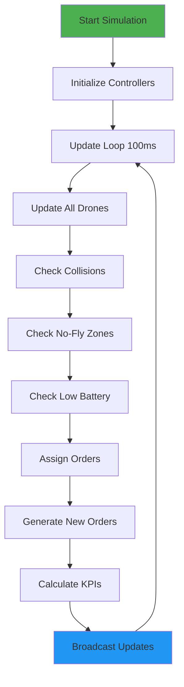

**Context Diagram:**

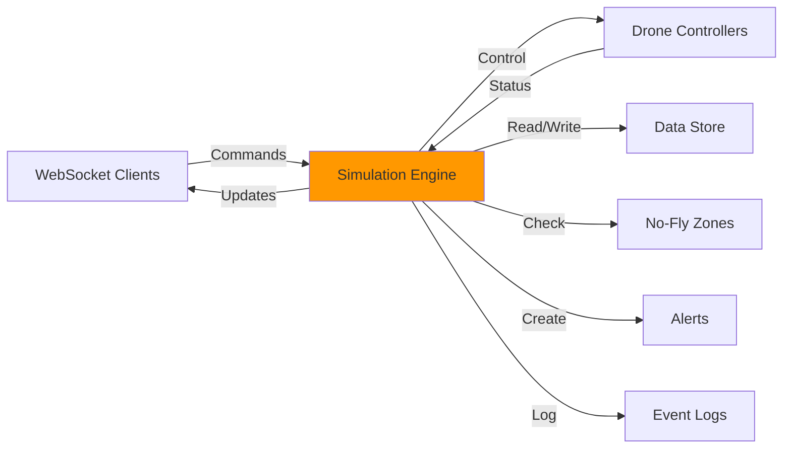

---

### 2. DRONE CONTROLLER MODULE

**Description:**  
Each drone has its own controller that manages its individual behavior, state transitions, and decision-making. The controller handles autonomous flight, battery management, order execution, and responds to emergency situations. It implements a state machine with 9 distinct states.

**Key Responsibilities:**
- Manage drone state transitions (IDLE → FLYING → DELIVERING → RETURNING)
- Execute waypoint-based navigation along routes
- Monitor battery levels and initiate emergency returns
- Handle order pickup and delivery sequences
- Manage charging queue at kiosks
- Respond to operator commands (force return, emergency land)
- Calculate battery consumption based on flight conditions

**Input:**
- Time delta for physics calculations
- Simulation speed multiplier
- Current weather conditions
- Operator commands (return, emergency land)
- Order assignments

**Process:**
- Update drone position using interpolation between waypoints
- Calculate battery drain based on distance, payload, altitude, weather
- Check if battery is sufficient for current mission
- Transition between states based on conditions
- Handle charging queue management at kiosks
- Execute delivery sequences with timing

**Output:**
- Updated drone position (lat, lng, altitude)
- Current battery level (0-100%)
- Status updates (IDLE, FLYING, CHARGING, etc.)
- Route completion notifications
- Emergency alerts when battery critical

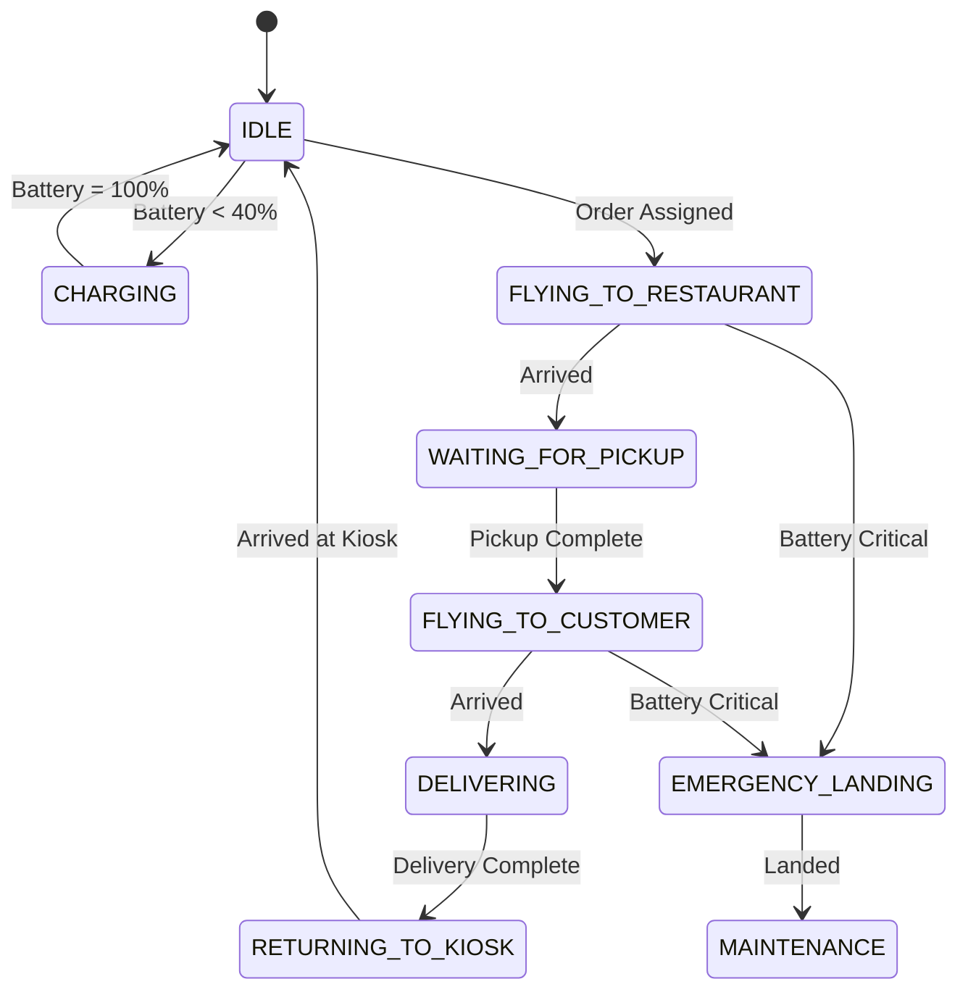

**Flowchart: Order Execution**

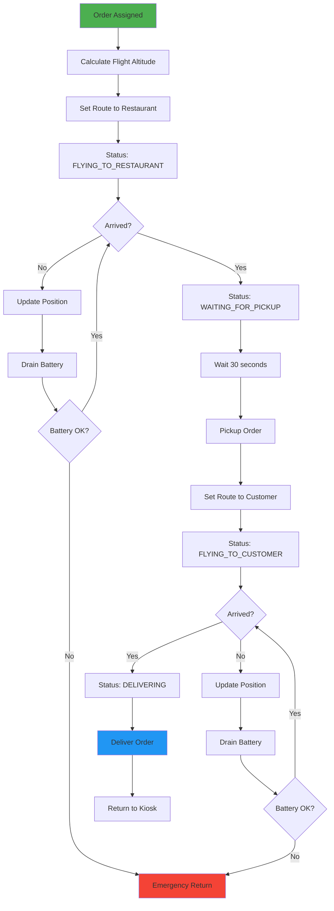

---

### 3. PATHFINDING SYSTEM MODULE

**Description:**  
The Pathfinding System provides navigation utilities for calculating routes, distances, and bearings between geographic coordinates. It uses the Haversine formula for accurate distance calculations on Earth's curved surface and implements no-fly zone avoidance and altitude layering for collision prevention.

**Key Responsibilities:**
- Calculate accurate distances using Haversine formula
- Compute bearing angles between coordinates (0-360°)
- Interpolate positions for smooth drone movement
- Detect no-fly zone violations using point-in-polygon algorithm
- Generate optimized routes avoiding restricted areas
- Assign flight altitudes based on direction (altitude layering)

**Input:**
- Start position (latitude, longitude, altitude)
- End position (latitude, longitude, altitude)
- No-fly zone polygons
- Interpolation progress (0.0 to 1.0)

**Process:**
- Convert latitude/longitude to radians
- Apply Haversine formula for great-circle distance
- Calculate bearing using arctangent of coordinate differences
- Check if waypoints intersect no-fly zones
- Add avoidance waypoints if necessary
- Determine altitude based on flight bearing

**Output:**
- Distance in kilometers
- Bearing in degrees (0-360)
- Interpolated position along route
- Optimized route with waypoints
- Flight altitude (80m or 100m)

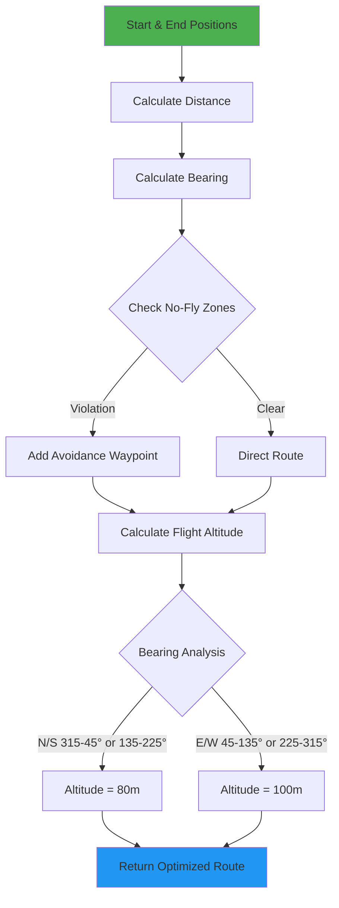

**Haversine Formula Diagram:**

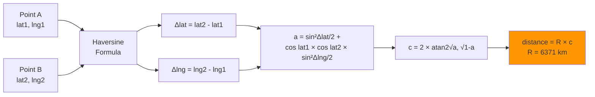

---

### 4. BATTERY MODEL MODULE

**Description:**  
The Battery Model simulates realistic battery consumption and charging for drones based on multiple factors including distance traveled, payload weight, altitude, weather conditions, and flight speed. It also provides range estimation and charging management.

**Key Responsibilities:**
- Calculate battery drain per flight segment
- Factor in payload weight, altitude, and weather
- Estimate remaining flight range
- Calculate charging rates and times
- Determine when drone should return to kiosk
- Manage idle battery drain

**Input:**
- Drone specifications (max battery capacity, current battery %)
- Distance traveled (kilometers)
- Current payload weight (kg)
- Altitude (meters)
- Weather condition and impact percentage
- Time elapsed (for charging/idle)

**Process:**
- Calculate base consumption (1% per km)
- Add payload factor (0.3% per kg per km)
- Add altitude factor (0.2% per 100m per km)
- Apply weather multiplier (1.0x to 2.0x)
- Sum all factors for total drain
- For charging: apply 50% per hour rate

**Output:**
- Battery percentage consumed
- Estimated remaining range (km)
- Charging percentage gained
- Boolean: should return to kiosk

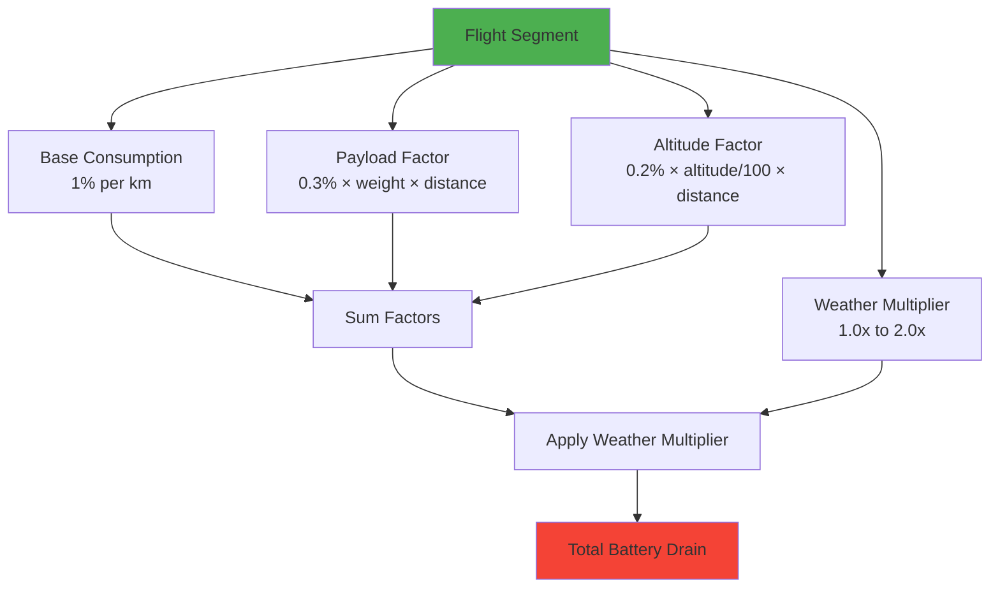

**Input-Process-Output Diagram:**

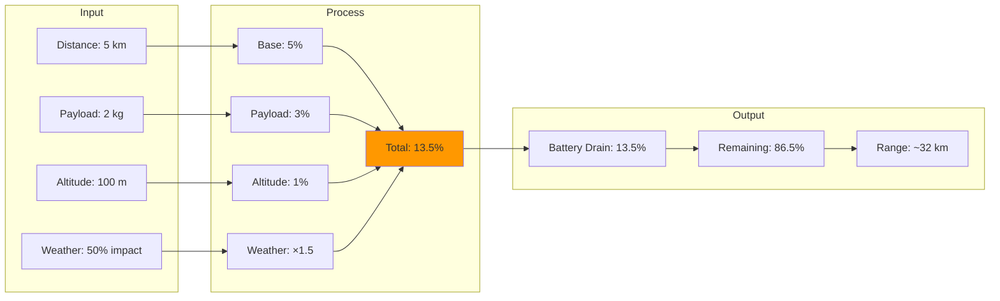

---

### 5. WEBSOCKET SERVER MODULE

**Description:**  
The WebSocket Server manages real-time bidirectional communication between the backend and all connected clients using Socket.IO. It handles client connections, broadcasts simulation updates, and processes commands from operators.

**Key Responsibilities:**
- Manage client connections and disconnections
- Broadcast drone position updates (100ms intervals)
- Send KPI metrics updates (2-second intervals)
- Emit alerts and event logs in real-time
- Handle simulation control commands
- Process drone commands from operators
- Manage order creation requests

**Input:**
- Client connection requests
- Simulation control commands (start, pause, speed)
- Drone commands (return, emergency land)
- Order creation requests
- Weather adjustment commands

**Process:**
- Establish WebSocket connections
- Register event listeners for all command types
- Batch and broadcast updates to all clients
- Validate incoming commands
- Forward commands to simulation engine
- Emit responses and acknowledgments

**Output:**
- Real-time drone updates to all clients
- KPI metrics broadcasts
- Alert notifications
- Event log updates
- Simulation state changes
- Command acknowledgments

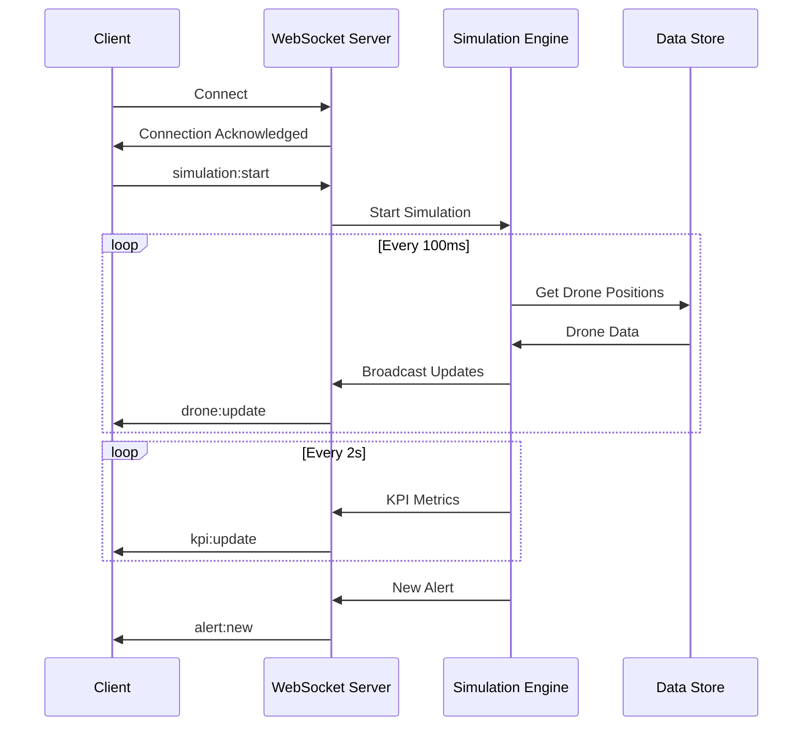

**Event Flow Diagram:**

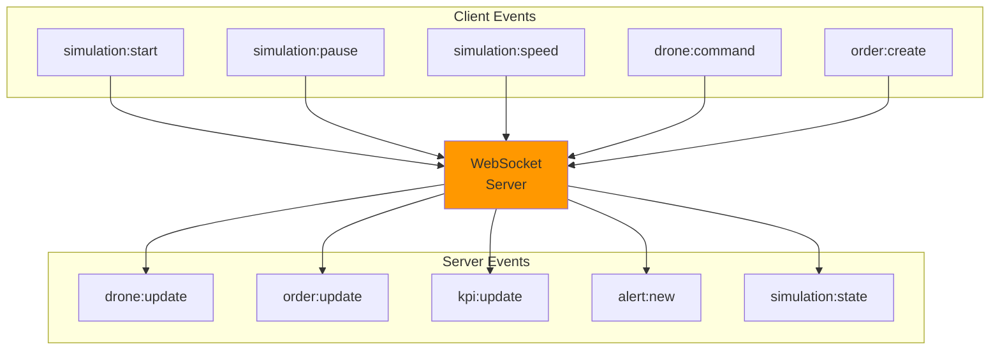

---

### 6. REST API MODULE

**Description:**  
The REST API provides HTTP endpoints for retrieving system data and creating orders. It serves as the primary interface for initial data loading and non-real-time operations, complementing the WebSocket server for real-time updates.

**Key Responsibilities:**
- Serve drone fleet data
- Provide order information
- Return kiosk and restaurant details
- Deliver alert history
- Supply KPI metrics
- Handle order creation
- Provide simulation state

**Input:**
- HTTP GET requests for data retrieval
- HTTP POST requests for order creation
- Query parameters for filtering

**Process:**
- Parse incoming HTTP requests
- Validate request parameters
- Query data store for requested information
- Format response as JSON
- Apply CORS headers
- Handle errors gracefully

**Output:**
- JSON responses with requested data
- HTTP status codes (200, 201, 400, 404, 500)
- Error messages for invalid requests

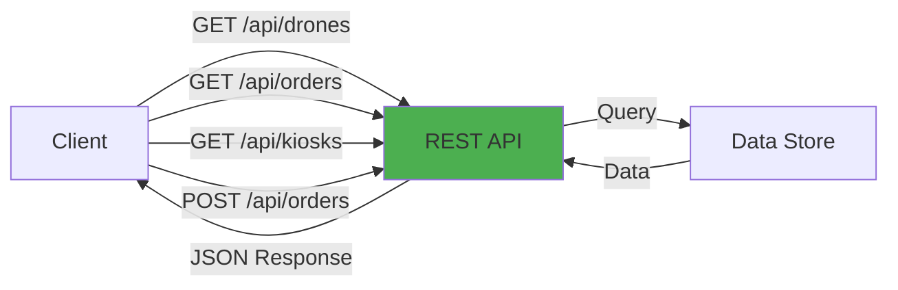

**API Endpoint Structure:**

```mermaid
graph TD
    A[REST API] --> B[GET Endpoints]
    A --> C[POST Endpoints]
    
    B --> D[/api/drones<br/>Get all drones]
    B --> E[/api/orders<br/>Get all orders]
    B --> F[/api/kiosks<br/>Get all kiosks]
    B --> G[/api/restaurants<br/>Get all restaurants]
    B --> H[/api/alerts<br/>Get all alerts]
    B --> I[/api/kpi<br/>Get KPI metrics]
    
    C --> J[/api/orders<br/>Create new order]
    
    style A fill:#2196F3
```

---

### 7. DATA STORE MODULE

**Description:**  
The Data Store is an in-memory database that maintains the current state of all entities in the simulation. It uses JavaScript Maps for efficient lookups and provides methods for creating, reading, updating, and deleting entities.

**Key Responsibilities:**
- Store all drones, orders, kiosks, restaurants
- Maintain alerts and event logs
- Initialize entities with default data
- Provide CRUD operations for all entity types
- Ensure data consistency
- Support fast lookups by ID

**Input:**
- Entity creation requests
- Entity update requests
- Query requests by ID or filters

**Process:**
- Initialize Maps for each entity type
- Populate with initial data (30 kiosks, 52 restaurants, 40 drones)
- Handle add/update/delete operations
- Maintain relationships between entities
- Generate unique IDs for new entities

**Output:**
- Entity data by ID
- Lists of all entities
- Filtered entity collections
- Success/failure confirmations

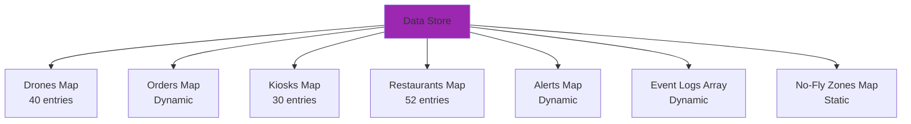

---

## FRONTEND MODULES

### 8. DASHBOARD MODULE

**Description:**  
The Dashboard is the main landing page that provides an at-a-glance view of the entire system's health and performance. It displays real-time KPI metrics, simulation controls, recent alerts, and quick access to all major features.

**Key Responsibilities:**
- Display 8 KPI cards with live metrics
- Provide simulation controls (start, pause, speed, scenario)
- Show recent alerts with severity indicators
- Display active orders and drone status
- Render charts for performance trends
- Enable quick navigation to other pages

**Input:**
- Real-time KPI updates via WebSocket
- Alert notifications
- Simulation state changes
- User interactions (button clicks)

**Process:**
- Subscribe to WebSocket events
- Update state in Zustand store
- Re-render components on data changes
- Format numbers and percentages
- Apply color coding based on thresholds
- Handle user control actions

**Output:**
- Visual KPI cards (total drones, active, orders, revenue)
- Simulation control panel
- Alert list with timestamps
- Performance charts
- Navigation links

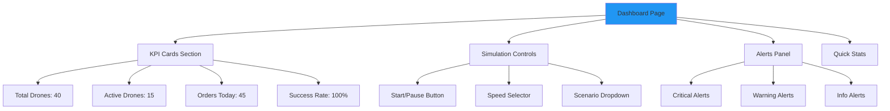

**Data Flow:**

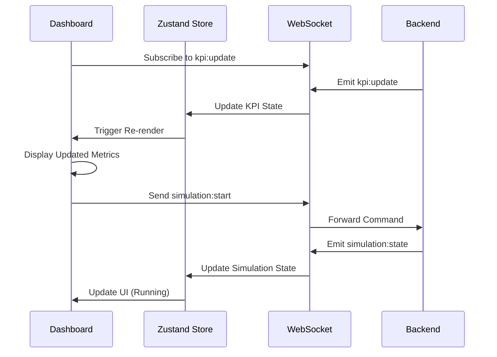

---

### 9. LIVE MAP MODULE

**Description:**  
The Live Map provides a real-time 3D visualization of all drones, kiosks, and restaurants on an interactive map. It uses MapLibre GL JS for hardware-accelerated rendering and displays drone positions, routes, and status information with 100ms update frequency.

**Key Responsibilities:**
- Render 3D tilted map of Delhi NCR
- Display 40 drone markers with real-time positions
- Show 30 kiosk markers and 52 restaurant markers
- Enable layer toggling (drones, kiosks, restaurants)
- Provide drone details panel on marker click
- Send drone commands (force return, emergency land)
- Display drone routes and flight paths

**Input:**
- Real-time drone position updates (100ms)
- User map interactions (pan, zoom, click)
- Layer toggle selections
- Drone command requests

**Process:**
- Initialize MapLibre GL map
- Create custom markers for each entity type
- Subscribe to drone:update WebSocket events
- Update marker positions smoothly
- Handle marker click events
- Render selected drone details
- Send commands via WebSocket

**Output:**
- Interactive 3D map visualization
- Real-time drone position updates
- Drone details sidebar
- Command confirmation messages
- Visual route lines

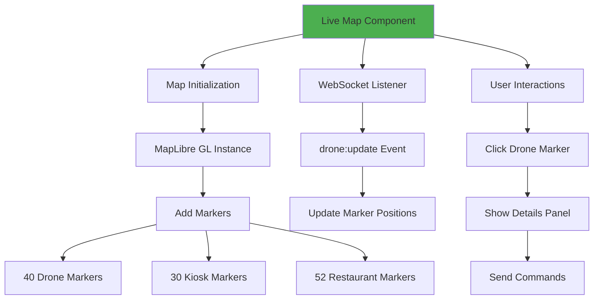

**Component Architecture:**

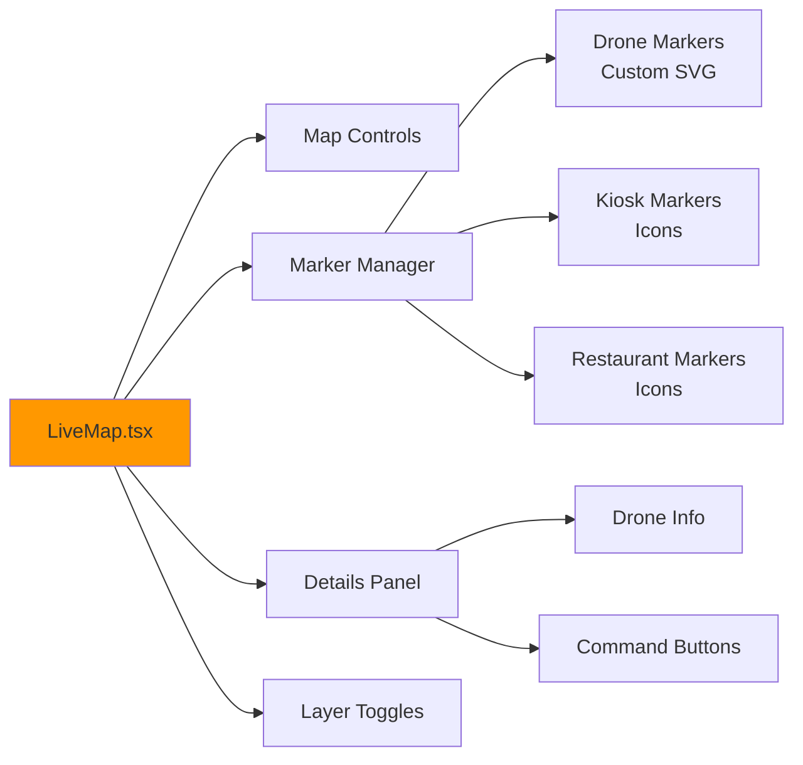

---

### 10. ORDER MANAGEMENT MODULE

**Description:**  
The Order Management module displays all delivery orders in a sortable, filterable table format. It shows order details, status, assigned drones, and delivery timelines. Users can create new test orders and track their progress through the delivery lifecycle.

**Key Responsibilities:**
- Display all orders in table format
- Filter orders by status (Pending, Assigned, In Transit, Delivered)
- Show order details (items, weight, price, timeline)
- Enable order creation with form validation
- Track order status changes in real-time
- Display estimated and actual delivery times

**Input:**
- Order list from REST API
- Real-time order updates via WebSocket
- User filter selections
- New order form data

**Process:**
- Fetch initial orders on page load
- Subscribe to order:update events
- Filter and sort orders based on user selection
- Validate new order form inputs
- Submit order creation requests
- Update table on order status changes

**Output:**
- Sortable order table
- Order status badges with colors
- Order creation form
- Success/error notifications
- Order timeline visualization

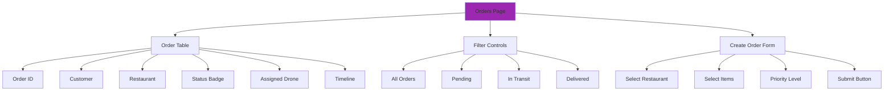

**Order Lifecycle Flow:**

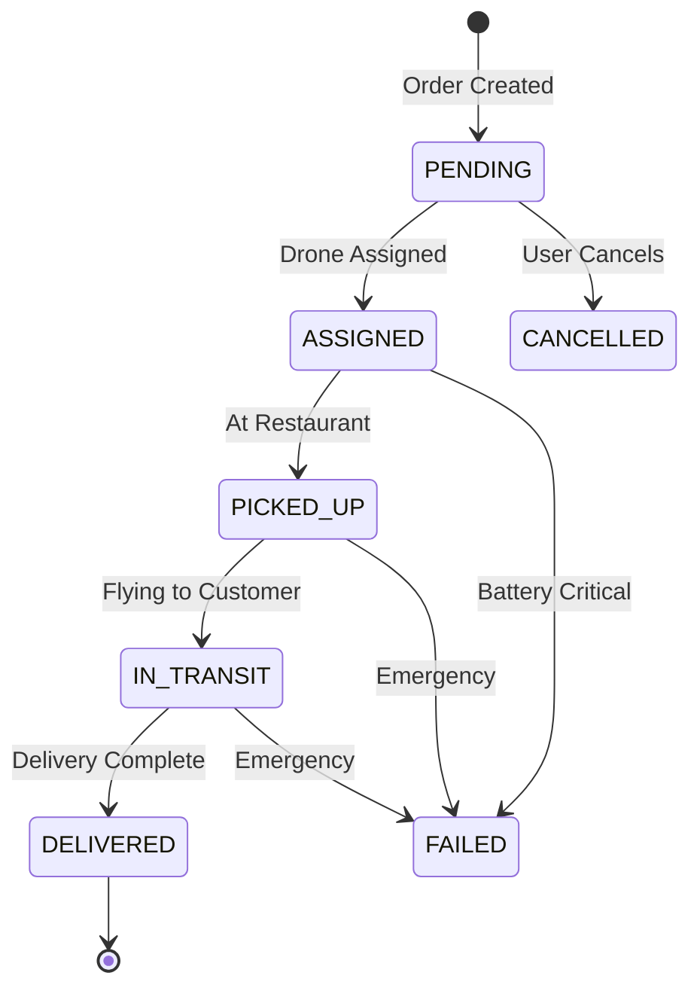

---

### 11. FLEET MANAGEMENT MODULE

**Description:**  
The Fleet Management module (Drones page) provides a comprehensive view of all drones in the fleet. It displays each drone's current status, battery level, location, assigned kiosk, flight statistics, and maintenance information in a card-based layout.

**Key Responsibilities:**
- Display all 40 drones in grid layout
- Show real-time battery levels with color coding
- Display current status and location
- Show flight statistics (total distance, flight time)
- Indicate assigned kiosk and current order
- Provide quick access to drone details
- Enable filtering by status

**Input:**
- Drone list from REST API
- Real-time drone updates via WebSocket
- User filter selections

**Process:**
- Fetch initial drone data
- Subscribe to drone:update events
- Update drone cards on status/battery changes
- Apply color coding based on battery level
- Filter drones by selected status
- Format statistics for display

**Output:**
- Grid of drone cards
- Battery level indicators (green/yellow/red)
- Status badges
- Flight statistics
- Kiosk assignments

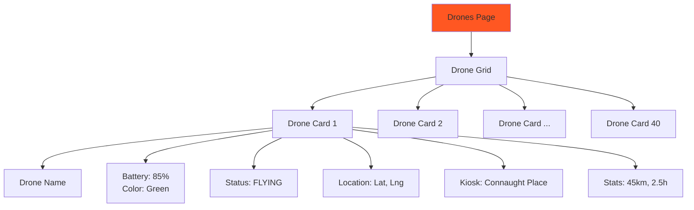

**Battery Level Color Coding:**

```mermaid
graph LR
    A[Battery Level] --> B{Check Level}
    B -->|> 60%| C[Green<br/>Healthy]
    B -->|40-60%| D[Yellow<br/>Warning]
    B -->|< 40%| E[Red<br/>Critical]
    B -->|< 15%| F[Red + Alert<br/>Emergency]
    
    style C fill:#4CAF50
    style D fill:#FFC107
    style E fill:#F44336
    style F fill:#D32F2F
```

---

### 12. AUTHENTICATION MODULE

**Description:**  
The Authentication module handles user login, session management, and role-based access control. It provides a login page, validates credentials, stores user sessions, and restricts access to features based on user roles (Admin, Restaurant Operator, Kiosk Operator).

**Key Responsibilities:**
- Display login form
- Validate user credentials
- Manage user sessions with Zustand
- Store authentication state
- Implement role-based access control
- Handle logout functionality
- Redirect based on authentication status

**Input:**
- Username and password from login form
- Session storage data
- Logout requests

**Process:**
- Validate form inputs
- Check credentials against stored users
- Create session on successful login
- Store user data in Zustand store
- Persist session to localStorage
- Check authentication on route changes
- Clear session on logout

**Output:**
- Authentication success/failure
- User role and permissions
- Session token
- Navigation to dashboard or login page

```mermaid
graph TB
    A[Login Page] --> B[Enter Credentials]
    B --> C{Validate}
    C -->|Valid| D[Create Session]
    C -->|Invalid| E[Show Error]
    D --> F[Store in Zustand]
    F --> G[Save to localStorage]
    G --> H[Redirect to Dashboard]
    E --> B
    
    I[Protected Route] --> J{Check Auth}
    J -->|Authenticated| K[Allow Access]
    J -->|Not Authenticated| L[Redirect to Login]
    
    style D fill:#4CAF50
    style E fill:#F44336
```

**Role-Based Access:**

```mermaid
graph TD
    A[User Login] --> B{Check Role}
    B -->|Admin| C[Full Access]
    B -->|Restaurant| D[Limited Access]
    B -->|Kiosk| E[Limited Access]
    
    C --> C1[Dashboard ✓]
    C --> C2[Live Map ✓]
    C --> C3[Orders ✓]
    C --> C4[Drones ✓]
    C --> C5[Analytics ✓]
    C --> C6[Settings ✓]
    
    D --> D1[Dashboard ✓]
    D --> D2[Orders ✓]
    D --> D3[Restaurant Stats ✓]
    
    E --> E1[Dashboard ✓]
    E --> E2[Kiosk Status ✓]
    E --> E3[Charging Queue ✓]
    
    style C fill:#4CAF50
    style D fill:#FFC107
    style E fill:#FFC107
```

---

## SYSTEM INTEGRATION DIAGRAM

```mermaid
graph TB
    subgraph Frontend
        F1[Dashboard]
        F2[Live Map]
        F3[Orders]
        F4[Drones]
        F5[Auth]
    end
    
    subgraph Communication
        WS[WebSocket<br/>Socket.IO]
        API[REST API<br/>Express]
    end
    
    subgraph Backend
        SE[Simulation<br/>Engine]
        DC[Drone<br/>Controllers]
        PF[Pathfinding]
        BM[Battery<br/>Model]
        DS[Data<br/>Store]
    end
    
    F1 --> WS
    F2 --> WS
    F3 --> WS
    F4 --> WS
    F1 --> API
    F3 --> API
    
    WS --> SE
    API --> DS
    SE --> DC
    DC --> PF
    DC --> BM
    DC --> DS
    SE --> DS
    
    style SE fill:#FF9800
    style WS fill:#2196F3
```

---

## MODULE INTERACTION SUMMARY

| Module | Interacts With | Purpose |
|--------|----------------|---------|
| Simulation Engine | All Drone Controllers, Data Store, WebSocket | Orchestrates simulation |
| Drone Controller | Pathfinding, Battery Model, Data Store | Manages individual drone |
| Pathfinding | Data Store (No-Fly Zones) | Route calculation |
| Battery Model | None (Pure calculation) | Battery physics |
| WebSocket Server | Simulation Engine, All Frontend | Real-time updates |
| REST API | Data Store | Data retrieval |
| Data Store | All Backend Modules | Central data repository |
| Dashboard | WebSocket, REST API | System overview |
| Live Map | WebSocket | Real-time visualization |
| Orders | WebSocket, REST API | Order management |
| Drones | WebSocket, REST API | Fleet monitoring |
| Auth | Data Store (Users) | Access control |

---

**END OF MODULE DOCUMENTATION**
